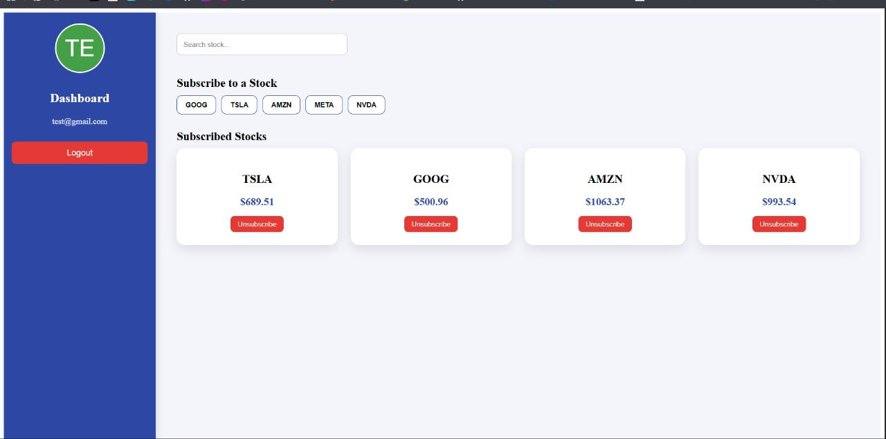

# 📌 Stock Broker Client Dashboard

A modern, visually appealing stock monitoring dashboard built using **React + Vite**, featuring real-time price updates, persistent login, animations, and a clean user experience.

---

## 🚀 Live Demo  
(Coming Soon)

---

### **Dashboard – Subscribed Stocks**

## ✨ Features

### 🔐 User Authentication  
- Login using email  
- Auto-load previous subscriptions  
- Persistent login using LocalStorage  

### 📈 Real-Time Stock Price Updates  
- Updates every 1 second  
- Uses random generator to simulate real feed  
- Smooth transitions and animations  

### ⭐ Beautiful Modern UI  
- Glassmorphism login page  
- Hover-expand animated sidebar  
- Stock cards with dropdown (3-dot menu)  
- Vanish animation when unsubscribing  
- Fully responsive  

### 📦 No Backend Required  
- All data stored in the browser  
- Great for demos, assignments, and prototypes  

---

## 🏛️ Project Structure

client/
│── public/
│── src/
│ ├── components/
│ │ ├── Login.jsx
│ │ ├── Dashboard.jsx
│ │ ├── StockCard.jsx
│ │ ├── Toast.jsx
│ ├── context/
│ │ ├── UserContext.jsx
│ ├── data/
│ │ ├── supportedStocks.js
│ ├── utils/
│ │ ├── randomPrice.js
│ ├── App.jsx
│ ├── main.jsx
│── package.json
│── README.md

🧠 How It Works
1️⃣ Login

Enter email → loads user data → redirects to dashboard.

2️⃣ Subscribe to Stocks

Click a stock button → instantly added to list.

3️⃣ Real-Time Price Updates

Every subscribed stock updates automatically every second.

4️⃣ Unsubscribe

Click the 3-dot menu → select Unsubscribe → card vanishes smoothly.

5️⃣ Refresh Safe

User stays logged in using LocalStorage.
